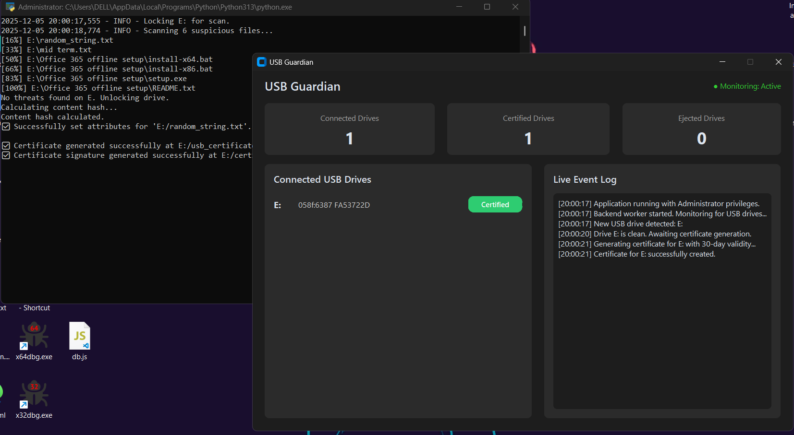
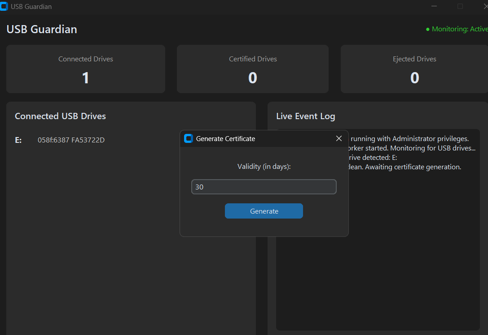

# USB Sanitizer & Guardian

**USB Sanitizer** is a dual-component security system designed to secure computer labs from data theft and malware introduction via USB drives. It enforces a strict "No Certificate, No Access" policy.

### 📸 Gallery


*The Admin Dashboard: Scans USBs and issues certificates.*


*The Lab Computer: Ejecting an uncertified USB automatically.*

---

## 🛡️ Security Workflow Model

Use this system to separate your environment into **Secure Lab Computers** and a **Central Admin Station**.

### 1. The Threat Scenario
A user (potentially malicious) approaches a Lab Computer and inserts a USB drive. They intend to steal data or introduce a virus.
- **Result**: The **Client Watcher** (`run_watcher_system.py`) on the Lab Computer immediately detects that the USB lacks a valid security certificate. The drive is denied access and **instantly ejected**.

### 2. The Verification Process
To use the USB, the user must visit the **Lab Admin**.
- The Lab Admin uses the **Admin Station** (`gui.py`) to scan the USB.
- **If Infected**: The Admin Station detects threats/viruses. No certificate is issued. The USB remains blocked.
- **If Safe**: The Admin Station confirms the drive is clean and generates a cryptographically signed **USB Certificate** (`usb_certificate.json`), binding it to the specific USB hardware.

### 3. Safe Access
The user returns to the Lab Computer.
- They insert the certified USB.
- The **Client Watcher** validates the certificate signature against the file contents and hardware ID.
- **Result**: Access is GRANTED. The USB works normally.

---

## 🚀 Components

### 🖥️ 1. Lab Admin Station (`gui.py`)
*Running on the Administrator's PC.*
- **Role**: The Gatekeeper.
- **Capabilities**:
  - Scanning USBs for malware (`.exe`, `.bat`, etc.).
  - Generating Digital Certificates.
  - Locking drives to prevent modifications before certification.

### 💻 2. Lab Computer Watcher (`run_watcher_system.py`)
*Running on all Student/Lab PCs.*
- **Role**: The Enforcer.
- **Capabilities**:
  - Runs silently in the background.
  - **Instant Ejection**: Automatically ejects any USB that:
    - Has no certificate.
    - Has a fake/tampered certificate.
    - Has an expired certificate.
  - **Real-time Monitoring**: Ensures no data is copied to/from unauthorized devices.

---

## 📦 Installation & Usage

### Prerequisites
- Windows 10/11
- Python 3.8+
- Administrator Privileges (Required for `diskpart` and `icacls`).

### Step 1: Setup
1. Clone the repository:
   ```bash
   git clone https://github.com/muhammadfaraz800/USB-Sanitizer.git
   cd USB-Sanitizer
   ```
2. Install dependencies:
   ```bash
   pip install -r requirements.txt
   ```

### Step 2: Running the System

#### On the LAB ADMIN PC:
Run the GUI to scan drives and issue certificates.
```bash
python gui.py
```

#### On the LAB COMPUTERS (Student PCs):
Run the watcher in the background to protect the system.
```bash
python run_watcher_system.py
```
*(Note: Ensure `public_key.pem` generated by the Admin PC is copied to the Lab PCs so they can verify the Admin's signature).*

---

## 📂 Project Structure

- `gui.py`: **Admin GUI**.
- `run_watcher_system.py`: **Lab Computer Watcher**.
- `hide_usb_drive.py`: Worker script for isolating USBs during validation.
- `cert_util.py`: Cryptographic logic for signing/verifying certificates.
- `usb_scanner.py`: Malware scanning logic.
- `generate_keys.py`: Generates the RSA Keys.

## ⚠️ Disclaimer
This tool interacts with low-level system commands. **Always backup important data.** Use at your own risk.

---
*Built for Information Security End Semester Project.*
